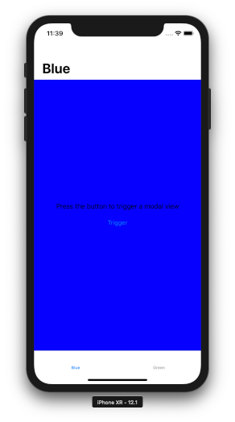
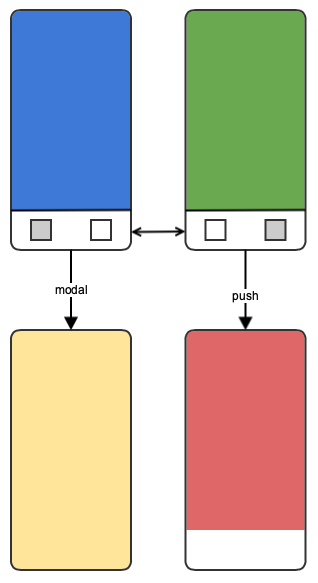

# MVVMC-Example

> This project is an example that shows how MVVM-C can be used to structure iOS apps that consist of multiple views.

For more information about the MVVM-C pattern, please watch the excellent talk ["MVVM-C In Practice" by Steve Scott](https://www.youtube.com/watch?v=9VojuJpUuE8).

This example project uses plain Swift to create an app with a tab bar and some transitions. It shows how the different views of an app can be separated into modules, how to wire up the transitions and how to pass data between the views.

## How to build

### Requirements
* Xcode 10
* Swift 4

Open the project file `HelloMVVMC.xcodeproj` with Xcode and hit CMD + R to run the example. No third party dependencies required.

## App Structure
The app consists of an UITabBarController with two tabs, each one containing a transition to another view.

The blue view contains a button that will show the yellow view modally. The green view pushes the red view onto the navigation stack and demonstrates how you can pass paratemers from one view to another.